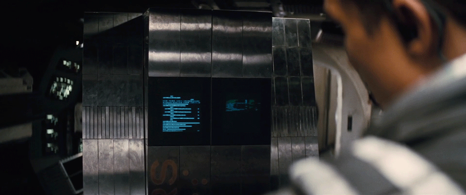

  

I'm [Tharlyson Ribeiro](https://www.linkedin.com/in/thjrribeiro/), a dedicated software developer with over 6 years of experience in solution development. I'm always looking to learn and currently focusing on Microservices, Distributed Systems and Clean Code.

---

- *Systems Analyst at [Matera](https://matera.com/)*
- *Graduate in Systems Analysis and Development*
- *Experienced in remote work and team work*

### Technologies
- *Git*
- *AWS*: S3, SQS, SNS;
- *Backend*: Java (Spring Boot, Spring Data, Spring Security), Node.js (JS/TS);
- *Frontend*: React.js, TailwindCSS, Angular 12+, Flutter;  
- *Databases*: MySQL, PostgreSQL, OracleDB, MongoDB;
- *Infrastructure*: Docker, Kubernetes, Jenkins, Keycloak (OAuth2, OpenID Connect);
- *Events*: Kafka, RabbitMQ;
- *API development*: Swagger (documentation & codegen), Monolithic and Microservices;
- *Agile*: Scrum/Kanban;
- *Learning*: Kotlin, DDD.

---
